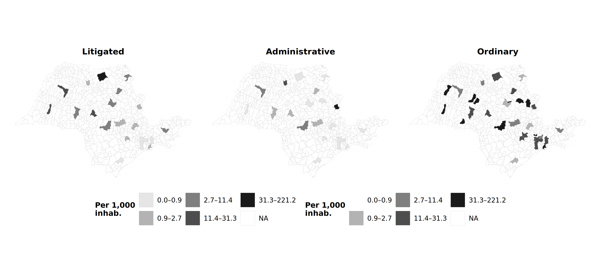
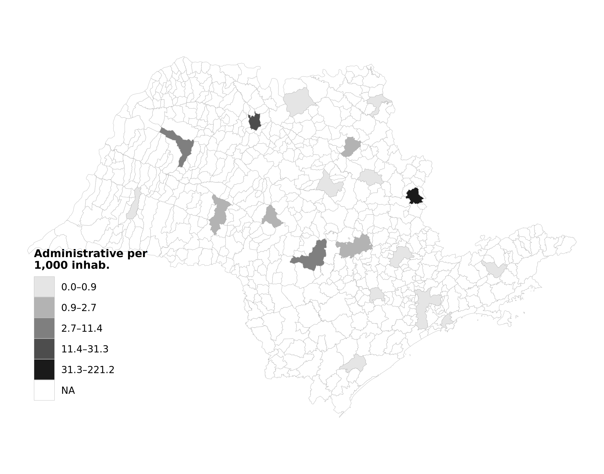
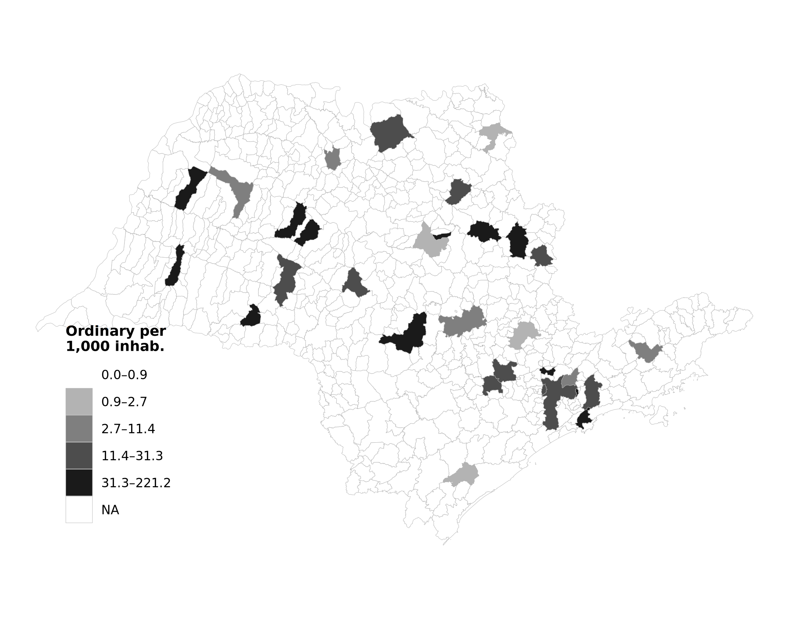

# Geographic Distribution Maps

These maps describe where each procurement channel — litigated, administrative urgent, and ordinary — operates across São Paulo state municipalities (2009–2019). Geography is not part of the v8 identification strategy (which is within firm-buyer-item, not cross-municipality), but the spatial heterogeneity contextualizes the institutional asset: the dual urgent channel covers the entire state, with neither litigated nor administrative procurement concentrated to a degree that would compromise within-cell variation.

---

## Three-Panel Comparison

<figure markdown>
  
  <figcaption>Per-capita procurement intensity by purchase type, common quintile breaks for comparability. SIRGAS 2000 / UTM Zone 23S (EPSG:31983). Source: BEC procurement data and IBGE population estimates (SIDRA table 6579).</figcaption>
</figure>

!!! info "Reading the panel"
    Litigated procurement concentrates in municipalities with stronger judicial infrastructure (state capital and major urban centers). Ordinary procurement is more uniformly distributed, reflecting baseline demand. Administrative urgent purchases follow the SES/SP scientific committee's admissibility decisions and concentrate where committee capacity is most active. The distinct geographies confirm that the within firm-buyer-item triples — which require both regimes for the same firm × item × buyer — are not driven by a small number of cells, but draw on variation across the state's procurement infrastructure.

---

## Individual Maps

### Litigated Purchases per 1,000 Inhabitants

<figure markdown>
  
</figure>

### Administrative Urgent Purchases per 1,000 Inhabitants

<figure markdown>
  
</figure>

### Ordinary Purchases per 1,000 Inhabitants

<figure markdown>
  
</figure>

---

## Technical Notes

- **Projection:** SIRGAS 2000 / UTM Zone 23S (EPSG:31983) — equal-area at São Paulo's latitude.
- **Breaks:** Quintile (5 equal-frequency categories) within each panel; common breaks across panels in the comparison figure for direct readability.
- **Population denominator:** IBGE SIDRA table 6579, 2009–2019 average.
- **Shapefile:** IBGE municipal boundaries via the `geobr` R package (2010 reference).
- **Color palette:** Sequential grayscale (5 levels), print-friendly.
- **What these maps are not:** they are **not** a causal identification strategy. The v8 paper relies on within firm-buyer-item triples, not cross-municipality comparisons. The maps are descriptive — they document the institutional reach of each channel.
