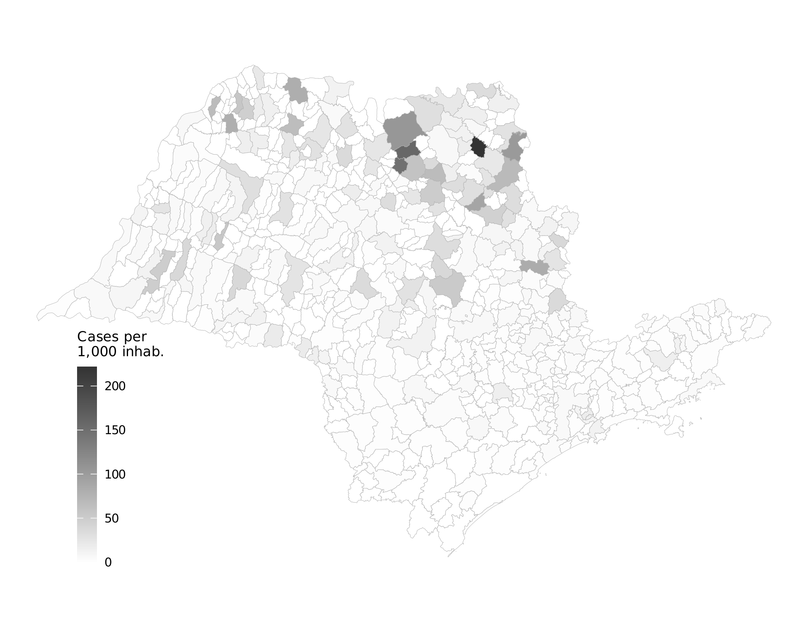

# Results

This page presents the empirical findings from the v8 sourcing-reframe of the paper. The headline result is conceptual: **within firm-buyer-item, the sanction premium is zero**; the cost of one-sided accountability operates through demand fragmentation and a sourcing shift, not through within-firm pricing.

See also: [Maps](maps.md) | [Changelog](changelog.md)

---

## Headline: Sourcing, not Pricing

<figure markdown>
  { width="100%" }
  <figcaption><strong>Figure 1.</strong> Decomposition of the admin-minus-litigated log-price gap. The within-firm component (same firm × same item × same buyer, both regimes) is statistically zero. The mechanical demand-fragmentation component (admin orders are roughly 3.3× larger than litigated) is large and negative. The composition residual reflects equilibrium changes in which firms win urgent purchases. Sanctions reorganize the supplier set far more than they reorganize the incumbent's price.</figcaption>
</figure>

---

## The Within Firm-Buyer-Item Null

The conceptual contribution of v8 is to identify the price channel inside the under-the-gun (UTG) contrast: same firm, same item, same buyer, both regimes.

| Object | Estimate |
|--------|----------|
| Triples observed under both regimes | 1,206 |
| Bid-level observations within those triples | 4,573 |
| Admin coefficient (preferred FE) | β̂ = 0.035 |
| Standard error | SE = 0.041 |
| Wild cluster bootstrap p-value (B = 999, Rademacher) | p = 0.008 — but for the *broader* UTG sample, see below |
| Conclusion | **No within-firm markup in deep markets** |

The null is robust on above-median-quantity items, SUS-formulary items, and the later period; it breaks on **thin-supplier subsamples** (below-median quantity, earlier period), where the incumbent does extract a sanction premium consistent with Prendergast (2007) — exactly where the delivery-risk-pricing prediction should bite.

---

## Bounding the Under-the-Gun Gap

Selection into the administrative channel is not random: the SES/SP scientific committee admits items that would have been cheaper under any regime (the committee admits on cost-effectiveness criteria; a pre-period probit confirms that admin over-represents items that would have been cheaper under any regime). Manski-Lee monotone bounds correct for this wedge.

| Statistic | Value |
|-----------|-------|
| Naïve UTG gap (cross-sectional) | ~29.5% (v7 framing) |
| Selection-corrected Manski-Lee bound (low) | **15.9%** |
| Selection-corrected Manski-Lee bound (high) | **21.1%** |
| Comparable-setting benchmark | Best et al. (2023): within-buyer dispersion at the lower end of this range; Bosio et al. (2022): cross-country procurement frictions ~15–25% |

The bounded UTG is **modest, not large** — at the lower end of within-buyer procurement-cost dispersion documented in comparable settings.

---

## Sourcing Shift

Among item-buyer pairs observed under both regimes, we measure how often the **identity** of the winning firm changes when the same item is purchased through the litigated vs. administrative channel.

| Metric | Value |
|--------|-------|
| Modal winner differs across regimes | **70.2%** of item-buyer pairs |
| Mean Jaccard similarity of winner sets | 0.268 |

**Sanctions reorganize the supplier set far more than they reorganize the incumbent's price.** This is the mechanical signature of accountability-induced sourcing distortion: the same buyer ends up with a different supplier under sanction pressure, and the equilibrium price shifts because of the composition change, not because the incumbent extracts a premium.

---

## Demand Fragmentation

<figure markdown>
  { width="100%" }
  <figcaption><strong>Figure 2.</strong> Distribution of admin-to-litigated quantity ratios for items observed in both regimes. Administrative orders are systematically larger than litigated orders — by roughly 3.3× on average. The bulk-discount channel mechanically delivers most of the admin-minus-litigated price gap.</figcaption>
</figure>

Court mandates dismantle the demand aggregation that procurement efficiency depends on. The mechanical contribution of fragmentation to the admin-minus-litigated log-price gap is approximately −32.8% — most of the observed gap.

---

## Identification Discipline

### Wild Cluster Bootstrap

For inference on the broader UTG Admin coefficient (preferred FE, full UTG sample, not just within-triple), we report wild cluster bootstrap p-values:

| Specification | p_boot | 95% log-point CI |
|---------------|:------:|:----------------:|
| Item + Year + PBU FE (preferred) | **0.008** | [−0.469, −0.039] |
| Item + Year-Month + PBU FE (saturated) | borderline | CI touches zero |

999 Rademacher replicates. Asymptotic standard errors may overstate precision in tightest specifications.

### Borusyak-Jaravel-Spiess Event Study with Rambachan-Roth Sensitivity

<figure markdown>
  { width="100%" }
  <figcaption><strong>Figure 3.</strong> Borusyak-Jaravel-Spiess event-study estimates with Rambachan-Roth honest-sensitivity overlay. The pre-period coefficients reach 4.1% in absolute value vs. a t = 0 effect of 5.4%; the parallel-trends claim does not survive linear extrapolation of the observed pre-period max (breakdown M = 0.018). The cross-sectional fixed-effects design is treated as primary; BJS event study reported as supportive Appendix evidence.</figcaption>
</figure>

### Placebo on Never-Litigated Items

| Outcome | Coefficient | SE |
|---------|:-----------:|:--:|
| Negotiated price (never-litigated items, urgency timeline) | −0.020 | 0.032 |

**Economically and statistically zero.** The urgency premium exists only inside the litigation pool; items that never face court mandates show no price effect from the urgency timeline alone.

### Heckman Parametric Correction

A parametric Heckman selection model on the committee acceptance probability is **degenerate** in this design: the inverse Mills ratio is collinear with the fixed effects (coef 0.82, SE 4.28). Reported as a sensitivity diagnostic flagging identification fragility, not as a competing point estimate. **The Lee bound is the primary selection-corrected object.**

---

## Welfare Bound

| Component | Value |
|-----------|-------|
| Annual litigated pharmaceutical spending in São Paulo | **\$300M** |
| Admissibility calibration (share of litigated demand admissible to admin channel) | 50% |
| Selection-corrected per-unit-price wedge (Lee midpoint) | ~18.5% |
| **Annual per-unit-price welfare cost** | **\$27.8M** (Lee range \$23.9M–\$31.7M) |

This is a **per-unit-price margin** and excludes welfare losses from constrained order sizes (the bulk-discount channel itself), reduced bidder participation, and officials' search time diverted from ordinary procurement. It replaces v7's stacked \$16–88M range with a single defensible bound.

---

## Geographic Context

<figure markdown>
  { width="100%" }
  <figcaption><strong>Figure 4.</strong> Health litigation cases per 1,000 inhabitants across municipalities in São Paulo state. Darker shading indicates higher litigation rates. The geographic variation in litigation intensity motivates the analysis.</figcaption>
</figure>

<figure markdown>
  { width="100%" }
  <figcaption><strong>Figure 5.</strong> Three-panel comparison of per-capita procurement intensity by purchase type — ordinary, administrative, and litigated. Quintile breaks under SIRGAS 2000 projection. Litigated procurement concentrates in different municipalities than administrative urgent demand, reflecting heterogeneity in legal infrastructure and judicial capacity.</figcaption>
</figure>

---

## Policy Lever

The empirical signature of one-sided accountability is the **absence** of a within-firm markup, not its presence. The cost margin is sourcing under fragmentation, not pricing under sanctions.

Two reforms address the two channels:

1. **Demand side — expand the administrative-request mechanism.** Eliminates within-urgent sanction exposure for the admissible share. Because the within-firm pricing component is zero, the gain is realized through demand aggregation; the binding parameter is committee capacity, not legal reform.
2. **Supply side — framework agreements** for repeat-purchase commodity-like medications. Address fragmentation directly by allowing aggregation across urgent and ordinary requests. We do not attach a recovery point estimate.

**Delivery is guaranteed; sourcing efficiency is the bill.**
