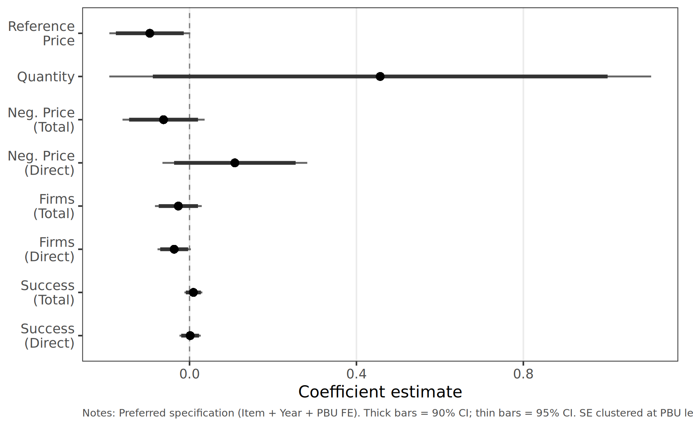

# Administrative vs Ordinary Purchases

## Why this comparison matters in v8

In the v8 sourcing-reframe, the **administrative** channel is not an independent finding — it is the **selection-corrected control group** that identifies the under-the-gun gap. The comparison between administrative and ordinary purchases serves two purposes:

1. **Diagnostic for admin-channel selection.** The SES/SP scientific committee admits items that are naturally more sourceable. Comparing admin to ordinary identifies the wedge that the Manski-Lee bounds correct for in the main UTG analysis.
2. **Validates the institutional asset.** Administrative purchases share all planning constraints of litigated procurement (compressed timelines, small quantities, urgent budget) but carry **no sanction exposure**. The price gap between litigated and administrative thus isolates the sanction channel net of urgency.

This page reports the descriptive admin-vs-ordinary comparison; for the main UTG analysis (litigated vs administrative), see [Results](results.md).

---

## Admin vs Ordinary: Preferred Specification

Sample: items with both administrative and ordinary purchase types (litigated purchases excluded). Item + Year + PBU fixed effects; SE clustered at PBU.

| Outcome | Coefficient | % Effect | Significance |
|---------|:-----------:|:--------:|:------------:|
| Reference Price | −0.095 | −9.1% | * |
| Quantity | +0.457 | +57.9% | n.s. |
| Negotiated Price (Total) | −0.062 | −6.0% | n.s. |
| Negotiated Price (Direct) | +0.109 | +11.5% | n.s. |
| Firms (Total) | −0.027 | −2.6% | n.s. |
| Firms (Direct) | −0.037 | −3.6% | * |
| Tender Success (Total) | +0.009 | +0.9 pp | n.s. |
| Tender Success (Direct) | +0.001 | +0.1 pp | n.s. |

<small>**Notes:** \* p < 0.10. Administrative urgent purchases (1) vs ordinary purchases (0). Effects computed as exp(β) − 1.</small>

!!! warning "Selection bias is the headline reading, not a causal effect"
    Administrative purchases carry **lower** reference prices than ordinary purchases (−9.1%, p < 0.10). In v7 framing this looked like a counterintuitive "admin is cheaper" effect; in v8 framing **this is exactly the selection wedge** — the scientific committee admits items that are easier to source and naturally cheaper, which biases admin toward lower observed prices regardless of treatment effect. The Manski-Lee bounds [15.9%, 21.1%] in the main UTG analysis correct for this wedge.

---

## Coefficient Plot

<figure markdown>
  
  <figcaption>Admin vs ordinary coefficients with 90% (thick) and 95% (thin) confidence intervals. Preferred specification (Item + Year + PBU FE), SE clustered at PBU.</figcaption>
</figure>

---

## Cross-Group Comparison

The full gradient across comparison groups, juxtaposed:

| Outcome | Urgent vs Ordinary | Litigated vs Ordinary | Admin vs Ordinary | UTG (Admin vs Litigated) |
|---------|:-----------------:|:---------------------:|:-----------------:|:------------------------:|
| Ref. Price | +2.7%* | +7.6%** | **−9.1%*** | naïve −27.3%; **Lee-bounded [−21.1%, −15.9%]** |
| Neg. Price (Total) | +5.4%*** | +9.1%*** | −6.0% | naïve −30.0%; Lee-bounded as above |
| Firms (Total) | −5.5%*** | −7.9%*** | −2.6% | n.s. |
| Tender Success | +2.1 pp*** | +2.4 pp*** | +0.9 pp | n.s. |

!!! info "v8 reading of this gradient"
    The naïve UTG gap (admin vs litigated; 27–30%) overstates the treatment effect because admin disproportionately admits the more sourceable items (the −9.1% admin-vs-ordinary reference-price effect). After Manski-Lee bounding, the **net sanction premium is [15.9%, 21.1%]** — modest, not headline-grabbing, and consistent with within-buyer dispersion in comparable settings (Best et al. 2023; Bosio et al. 2022). The remaining premium operates through demand fragmentation and a sourcing shift, not through within-firm pricing — see [Results](results.md).
